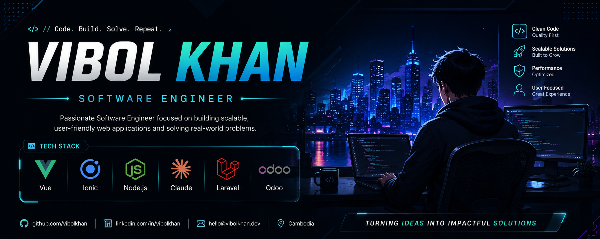

<!-- Banner -->
<p align="center">
  
</p>

<!-- Profile Picture -->
<p align="center">
  
</p>

<h1 align="center">Hi 👋, I'm Vibol Khan</h1>

<h3 align="center">
Software Engineer • JavaScript • TypeScript • React • Vue
</h3>

<p align="center">

</p>

<p align="center">
<a href="https://github.com/vibolkhan">

</a>


</p>

---

# 💫 About Me

```javascript
const Vibol = {
    location: "Cambodia",
    role: "Frontend Developer",
    languages: ["JavaScript", "TypeScript"],
    frontend: ["React", "Vue", "HTML5", "CSS3"],
    backend: ["Node.js", "Express"],
    database: ["PostgreSQL", "MySQL"],
    tools: ["Git", "GitHub", "VS Code", "Postman"],
    currentlyLearning: [
        "System Design",
        "Docker",
        "Cloud",
        "CI/CD"
    ],
    motto: "Keep Learning 🚀"
}
```

---

# 🚀 Tech Stack

<p align="center">


</p>

---

# 📈 GitHub Statistics

<p align="center">


</p>

---

# 🔥 GitHub Streak

<p align="center">


</p>

---

# 🏆 GitHub Trophies

<p align="center">


</p>

---

# 📊 Contribution Graph

<p align="center">


</p>

---

# 🐍 Contribution Snake

<p align="center">


</p>

> **Note:** This requires a GitHub Action to generate the snake animation.

---

# 🌟 Featured Projects

<table>
<tr>
<td width="50%">

### 💼 Payroll System

Modern payroll management system.

- Employee Management
- Tax Calculation
- Leave Management
- Reports

</td>

<td width="50%">

### 📊 Dashboard

Responsive admin dashboard.

- Charts
- Authentication
- Analytics
- REST API

</td>
</tr>

<tr>
<td>

### 🌐 Portfolio Website

Personal portfolio built with React.

</td>

<td>

### 🚀 Open Source

More exciting projects coming soon!

</td>
</tr>
</table>

---

# 🌱 Currently Learning

- ⚛️ Advanced React
- ☁️ Cloud Computing
- 🐳 Docker
- ⚙️ CI/CD
- 🏗️ Software Architecture

---

# 📫 Connect With Me

<p align="center">

<a href="https://github.com/vibolkhan">

</a>

<a href="YOUR_LINKEDIN">

</a>

<a href="mailto:YOUR_EMAIL">

</a>

</p>

---

<p align="center">

### 💡 Quote of the Day

> *"Code. Learn. Build. Repeat."*

</p>

---

<p align="center">

⭐ **Thanks for visiting my profile!** ⭐

</p>
